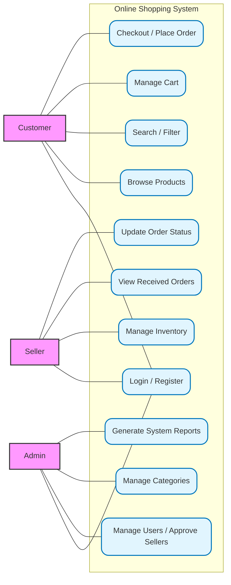

# Online Shopping System 🛒

A full-stack e-commerce platform developed to demonstrate modern software engineering and Agile principles. This system features robust role-based access control, allowing customers to seamlessly browse and purchase items, sellers to efficiently manage their inventory, and administrators to securely oversee the entire platform.

## 👥 Team Members
*   **Ashan** – Product Owner
*   **Ishara** – Scrum Master
*   **Binath** – UI/UX Designer
*   **Chathura** – Software Developer

---

## 🏗️ System Architecture & Use Cases



---

## 🚀 Core Features
*   **Customer Portal:** Browse products, search and filter by category/price, manage a shopping cart, and complete the checkout process.
*   **Seller Dashboard:** Dedicated workspace to add new product listings, update stock quantities, and manage order statuses (Pending, Shipped, Delivered).
*   **Admin Dashboard:** High-level access to approve new seller accounts, manage system categories, and view overarching sales reports.

---

## 💻 Tech Stack
*   **Frontend:** React.js, React Router
*   **Backend:** Node.js, Express.js
*   **Database:** MySQL
*   **Tools:** Git, GitHub Projects (Agile/Scrum Management)

---

## ⚙️ Local Setup & Installation

### 1. Database Configuration
1. Open MySQL Workbench.
2. Execute the `database_setup.sql` script located in the `/backend` folder to generate the required tables.
3. Update the database connection credentials in the `/backend/.env` file.

### 2. Running the Backend Server
```bash
cd backend
npm install
npm run dev
```

### 3. Running the Frontend Application
```bash
cd frontend
npm install
npm start
```

---

## 🔐 Test Credentials
To evaluate the role-based dashboards without creating new accounts, please use the following default credentials:

*   **Administrator:** `admin@store.com` | `adminpassword123`
*   **Seller:** `seller@store.com` | `sellerpassword123`